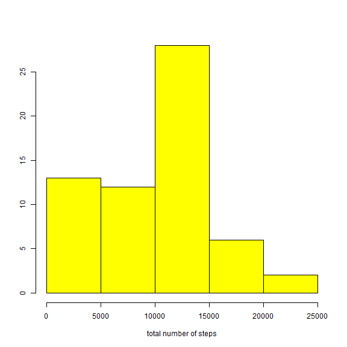
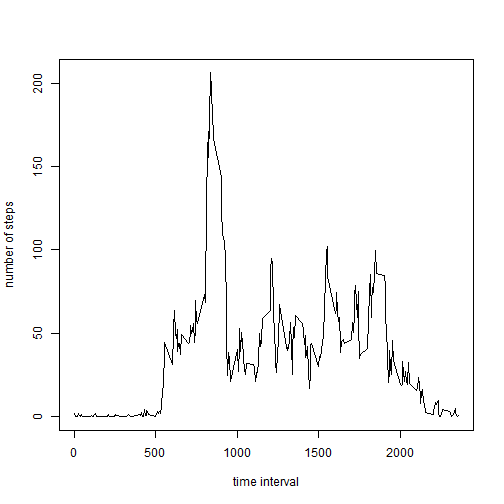
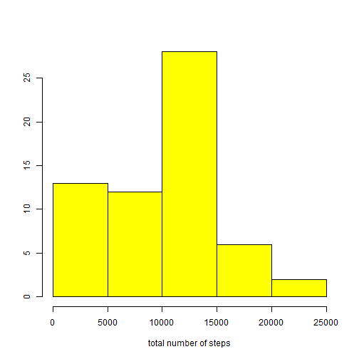
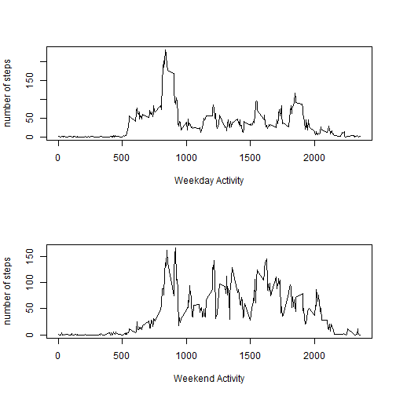

Reproducible Research - Project 1
===========================================================
Begin by reading in the data

```r
act=read.csv("activity.csv")
```
Now create a histogram of the number of the total number of steps taken each day and find the mean 
and the median of the total.

```r
S=with(act,tapply(steps,date,sum,na.rm=T))
hist(S,main="",xlab="total number of steps",ylab="",col="yellow")
```

 

```r
print(c("The mean is",round(mean(S))))
```

```
## [1] "The mean is" "9354"
```

```r
print(c("The median is",median(S)))
```

```
## [1] "The median is" "10395"
```
Create a time series plot of the average number of steps (over the 61 days) for each five minute interval.

```r
T=with(act,tapply(steps,interval,mean,na.rm=T))
plot(names(T),T,type="l",xlab="time interval",ylab ="number of steps")  
```

 

Now we find out which five minute interval, on average, has the greatest average number of steps.


```r
which(T==max(T))
```

```
## 835 
## 104
```

```r
T[which(T==max(T))]
```

```
##   835 
## 206.2
```

The maximum occurs during the 104th 5 minute interval, starting at 8:35 a.m. That maximum average is 206 steps.

Now, by creating a summary of the data we see that there are 2304 rows with missing data, 2304 five minute intervals for which no number was reported:


```r
summary(act)
```

```
##      steps               date          interval   
##  Min.   :  0.0   2012-10-01:  288   Min.   :   0  
##  1st Qu.:  0.0   2012-10-02:  288   1st Qu.: 589  
##  Median :  0.0   2012-10-03:  288   Median :1178  
##  Mean   : 37.4   2012-10-04:  288   Mean   :1178  
##  3rd Qu.: 12.0   2012-10-05:  288   3rd Qu.:1766  
##  Max.   :806.0   2012-10-06:  288   Max.   :2355  
##  NA's   :2304    (Other)   :15840
```
In this next section we create the new data set "act2" with each missing value replaced by the average for that same time interval over the 61 days. Those averages are already stored in T: the average number of steps taken at 8:35 a.m. is T[["835"]]


```r
act2 = act
for (k in 1:17568)
{if (is.na(act[k,"steps"])) act2[k,"steps"]= T[[as.character(act[k,"interval"])]]
}
```
Next we once again make a histogram of the total number of steps taken per day and recalculate the mean and the median. As we replaced 13% (2304 out of 17568) of the original data set which had been missing, it is not a surprise that the mean and the median increase somewhat.


```r
S2=with(act2,tapply(steps,date,sum,na.rm=T))
hist(S,main="",xlab="total number of steps",ylab="",col="yellow")
```

 

```r
print(c("The mean is",round(mean(S2))))
```

```
## [1] "The mean is" "10766"
```

```r
print(c("The median is",round(median(S2))))
```

```
## [1] "The median is" "10766"
```
Now we add a column factor to act2 consisting of the day of the week and split the result into weekdays and weekend:


```r
act2$day=weekdays(as.Date(act2$date))
act2wday =subset(act2, ! day %in% c("Saturday","Sunday"))
act2wkend =subset(act2,  day %in% c("Saturday","Sunday"))
```

Finally we make time series plots comparing the average number of steps over the five minute intervals on weekdays and weekends.


```r
par(mfrow=c(2,1))
Tday=with(act2wday,tapply(steps,interval,mean))
plot(names(Tday),Tday,type="l",xlab="Weekday Activity",ylab ="number of steps")
Tend=with(act2wkend,tapply(steps,interval,mean))
plot(names(Tend),Tend,type="l",xlab="Weekend Activity",ylab ="number of steps")
```

 

